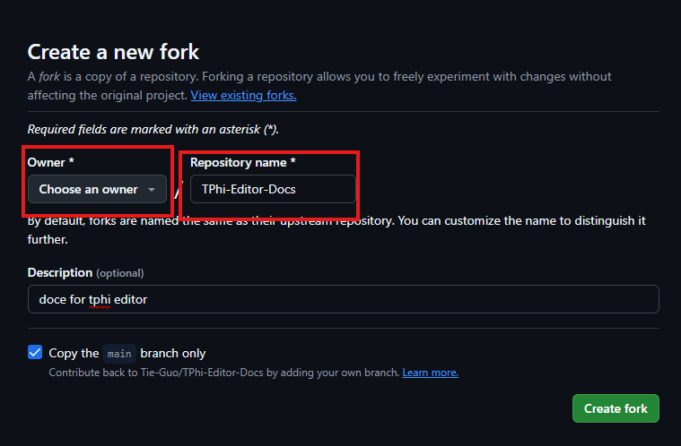

# 本文档站的贡献者指南

## 开始之前

需要准备以下工具：
* Github账户（没有账户的可以去[这个链接](https://github.com/signup)注册一个）
* 熟悉一下Git
* 一定的TPhi Editor使用经验（不一定，看到侧边栏的邪修教程了吗？）
* 一些其他软件的使用经验（具体看下列列表，不要求全部掌握）
    * Adobe Photoshop或者Clip Studio Paint
    * Re:PhiEdit（必须）
    * Microsoft 365
    * 一定的防骗知识（本文后面会讲）
    * Markdown语法经验（必须）
* 起码把[Docsify官方文档](https://docsify.js.org)看一遍（**别用Github Actions脚本，会出事的**）

## 创建一个fork仓库

首先，我们转到[这个仓库](https://github.com/Tie-Guo/TPhi-Editor-Docs)。

然后点击上面的Fork（看下图）。


在接下来的页面中，给仓库名称命名并选择所有之后，点击“Create Fork”。



> 这里的Description是可以留空的，但是为了方便所有创作者，建议写上。**一句话概括就行。**

之后找到你刚才创建的fork，像往常一样clone，pull和push。

有关Git的一些教程参考[此处](https://git-scm.com/book/zh/v2)。

## 上传图时要注意的点

使用Markdown上传时，只跟图像就好。

``` Markdown

```

如果后面是想用HTML上传，请以index.html所在的位置作为相对路径的起点（为什么）。

``` HTML

```

## Git推送相关

首次推送仓库前，请运行一下这个命令（前面的路径可忽略，仅为演示）：
``` Bash
$ git config --global user.name "John Doe"
$ git config --global user.email johndoe@example.com
```

之后按照你所用的代码编辑器的源代码管理集成完成提交和仓库推送（你可能会被要求登录，别慌）。

> [!WARNING] 如果你在推送更改时遇到报错，请勿惊慌。尝试更换网络环境并重新推送更改（本地文件绝对没事）。

## 最后，去开一个Pull Request！

回到你刚才克隆的仓库主页，如果找不到你仓库了，请在仓库根目录运行`git remote -v`来查看远程仓库的URL。

在你的fork仓库主页，点击contribute，然后点击Create Pull Request。

在点击之后的下一个页面当中，你有机会检验你的更改。